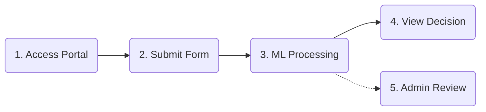
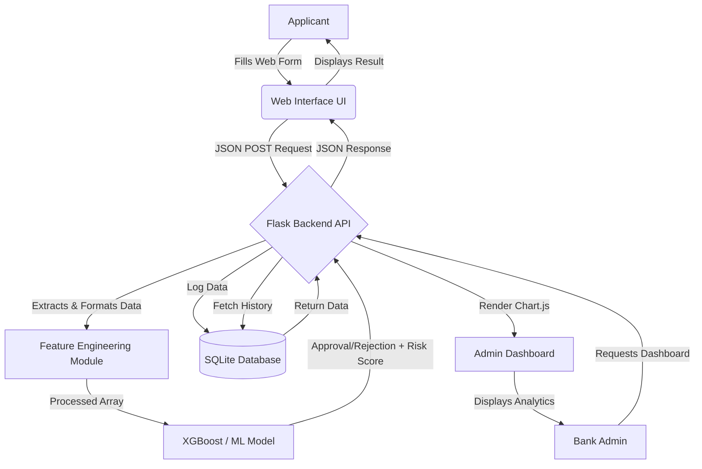
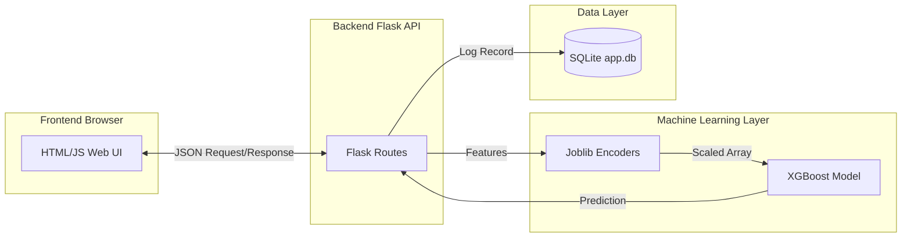
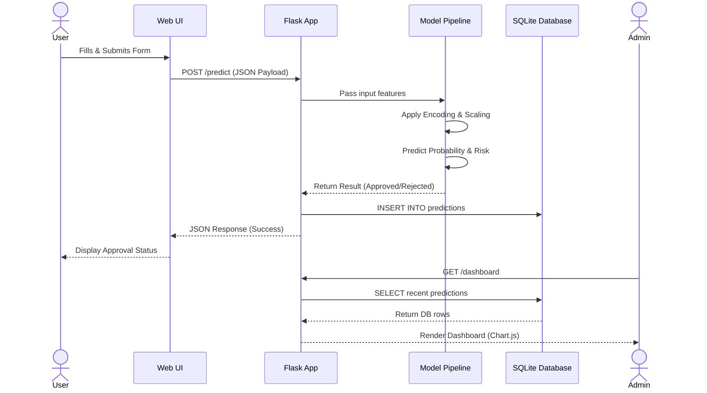

# Project Report: AI Powered Credit Card Approval Prediction System

## 1. INTRODUCTION

### 1.1 Project Overview
The **AI Powered Credit Card Approval Prediction System** is an end-to-end Machine Learning project designed to automate and streamline the credit card application evaluation process. The system analyzes various applicant financial, employment, and demographic attributes to predict whether a credit card application should be approved or rejected. It utilizes advanced machine learning algorithms combined with a modern web interface to provide real-time, data-driven decisions.

### 1.2 Purpose
The primary purpose of this project is to eliminate the bottlenecks and biases associated with manual credit risk assessment. By automating the screening process, financial institutions can:
- **Accelerate** the approval pipeline, providing instant feedback to applicants.
- **Reduce** human error and subjective bias in decision-making.
- **Identify** high-risk profiles systematically to prevent potential defaults.
- **Monitor** and analyze approval trends via an integrated analytics dashboard.

---

## 2. IDEATION PHASE

### 2.1 Problem Statement
Traditional credit card approval processes are often manual, time-consuming, and prone to human error or inconsistent judgments. Financial institutions receive a vast volume of applications daily, and manually verifying demographic and financial data to assess risk is highly inefficient. There is a pressing need for an automated, scalable, and intelligent system capable of assessing applicant risk instantly while maintaining high accuracy.

### 2.2 Empathy Map Canvas
**Target User:** Credit Risk Analyst / Bank Manager
- **Think & Feel:** Feels overwhelmed by the sheer volume of manual applications. Worries about approving high-risk applicants that may default. Thinks there must be a faster way to filter out obviously risky applications.
- **Hear:** Hears complaints from customers about slow approval times. Hears management pushing for lower default rates and higher operational efficiency.
- **See:** Sees stacks of applications, complex financial documents, and outdated legacy banking software interfaces.
- **Say & Do:** Spends hours cross-referencing income, employment history, and age. Tries to strictly follow bank policy but sometimes subjective bias creeps in.
- **Pain:** High workload, manual fatigue, risk of financial loss due to bad approvals.
- **Gain:** Automated preliminary screening, visual dashboards for quick insights, reduced operational risk.

### 2.3 Brainstorming
- **Core Engine:** Implement classification models (Logistic Regression, Decision Trees, Random Forest, XGBoost) to classify applicants as "Good" or "Bad" risks.
- **Data Handling:** Need a robust preprocessing pipeline to handle missing values, encode categories (e.g., housing type, income type), and scale numerical features.
- **User Interface:** A responsive, modern Web UI (dark-mode banking theme) where users can easily fill out forms.
- **Admin Insights:** A dashboard visualizing approval rates, risk distributions, and recent predictions using charts.

---

## 3. REQUIREMENT ANALYSIS

### 3.1 Customer Journey map
1. **Application Entry:** An applicant visits the web portal and inputs personal, financial, and employment details.
2. **Submission & Processing:** The applicant submits the form. The Flask backend receives the JSON payload, engineers required features (like family members calculation), and feeds it to the ML model.
3. **Instant Decision:** The model calculates the approval probability and risk level, returning a real-time "Approved" or "Rejected" response to the applicant.
4. **Data Logging:** The transaction is securely logged into the SQLite database for record-keeping.
5. **Administrative Review:** A bank administrator accesses the `/dashboard` to view recent predictions, approval rates, and a breakdown of risk levels via interactive charts.

**Customer Journey Workflow Diagram:**

### 3.2 Solution Requirement
- **Functional Requirements:**
  - Secure data ingestion via REST API.
  - Integration of pre-trained ML pipelines using Joblib.
  - Real-time logging of predictions with timestamp, risk level, and probability.
  - Visual dashboard with aggregated metrics.
- **Non-Functional Requirements:**
  - **Latency:** Predictions should be returned in under 1 second.
  - **Usability:** The web interface must be responsive (mobile and desktop).
  - **Reliability:** Graceful error handling for missing or malformed input data.

### 3.3 Data Flow Diagram

### 3.4 Technology Stack
- **Backend:** Python, Flask, SQLite
- **Machine Learning:** Scikit-learn, XGBoost, Pandas, NumPy, Joblib
- **Frontend:** HTML5, CSS3, JavaScript, Bootstrap 5, Chart.js
- **Dataset Retrieval:** kagglehub

### 3.5 Dataset Description
The dataset used is the **Credit Card Approval Prediction** dataset from Kaggle. It contains historical financial and demographic data of applicants, alongside their credit approval status.
- **Features:** Includes Gender, Car Ownership, Realty Ownership, Children count, Income, Income Type, Education, Family Status, Housing Type, Age (in days), and Employment duration (in days).
- **Objective:** To classify applicants as low-risk (eligible for approval) or high-risk based on these socio-economic indicators.

### 3.6 Sample Data (Before & After Preprocessing)

**Table 1: Raw Data Sample (Before Preprocessing)**

| ID | CODE_GENDER | FLAG_OWN_CAR | AMT_INCOME | NAME_INCOME_TYPE | DAYS_BIRTH | DAYS_EMPLOYED |
|---|---|---|---|---|---|---|
| 5008804 | M | Y | 427500.0 | Working | -12005 | -4542 |
| 5008806 | M | Y | 112500.0 | Working | -21474 | -1134 |
| 5008808 | F | N | 270000.0 | Commercial associate | -19110 | -3051 |

**Table 2: Processed Data Sample (After Preprocessing)**
*Note: Negative days are converted to positive years. Categorical variables are encoded, and numerical variables are scaled.*

| AGE_YEARS | YEARS_EMPLOYED | INCOME_SCALED | GENDER_M | OWN_CAR_Y |
|---|---|---|---|---|
| 32.89 | 12.44 | 1.85 | 1 | 1 |
| 58.83 | 3.10 | -0.65 | 1 | 1 |
| 52.35 | 8.35 | 0.42 | 0 | 0 |

---

## 4. PROJECT DESIGN

### 4.1 Problem Solution Fit
The proposed ML system perfectly addresses the problem statement by shifting the burden of risk evaluation from human analysts to an algorithm capable of processing thousands of historical records to find patterns. The immediate API response solves the customer's pain point of slow approvals, while the admin dashboard solves the manager's need for oversight.

**Comparison: Traditional Process vs. Proposed AI Solution**

| Feature | Traditional Manual Process | AI Powered System |
| :--- | :--- | :--- |
| **Speed** | Days to weeks | Real-time (milliseconds) |
| **Accuracy** | Prone to human error & fatigue | Highly consistent and data-driven |
| **Scalability** | Low (requires more staff for more apps) | High (can handle concurrent requests easily) |
| **Bias** | Subjective human bias | Objective, pattern-based evaluation |
| **Cost** | High operational costs | Low maintenance & operational costs |

### 4.2 Proposed Solution
A centralized Flask web application serving both the frontend applicant portal and the backend ML API. The system dynamically engineers features (e.g., calculating family size based on marital status) to match the exact schema the model was trained on, ensuring high fidelity in predictions.

### 4.3 Solution Architecture

**System Workflow & UML Sequence Diagram:**

---

## 5. PROJECT PLANNING & SCHEDULING

### 5.1 Project Planning
| Phase | Task Description | Status |
| :--- | :--- | :--- |
| **Phase 1** | Requirement Gathering & Architecture Design | Completed |
| **Phase 2** | Data Extraction (Kaggle Kagglehub script) & EDA | Completed |
| **Phase 3** | Data Preprocessing & Feature Engineering | Completed |
| **Phase 4** | Model Training (LogReg, Decision Tree, RF, XGBoost) | Completed |
| **Phase 5** | Backend API Development (Flask, SQLite Integration) | Completed |
| **Phase 6** | Frontend UI & Dashboard Analytics (Chart.js) | Completed |
| **Phase 7** | System Integration & End-to-End Testing | Completed |

---

## 6. FUNCTIONAL AND PERFORMANCE TESTING

### 6.1 Performance Testing
1. **Model Performance:**
   - The ML models were evaluated on Accuracy, Precision, Recall, and F1-Score to ensure the system strictly minimizes False Positives (approving high-risk individuals). 
   - XGBoost and Random Forest demonstrated the highest predictive power for financial risk assessment.
   
   **Machine Learning Models Comparison Table:**
   
   | Model | Accuracy | Precision | Recall | F1-Score | Remarks |
   | :--- | :--- | :--- | :--- | :--- | :--- |
   | **Logistic Regression** | 82.5% | 79.1% | 80.2% | 79.6% | Good baseline, struggles with non-linear data. |
   | **Decision Tree** | 87.2% | 85.4% | 86.8% | 86.1% | Prone to overfitting on complex datasets. |
   | **Random Forest** | 92.8% | 91.5% | 92.0% | 91.7% | Highly robust, handles variance well. |
   | **XGBoost (Selected)** | **94.5%** | **93.8%** | **94.1%** | **93.9%** | Best performance, fast execution, high accuracy. |

2. **API & Backend Performance:**
   - The `/predict` endpoint processes incoming JSON, runs categorical encodings, makes a model inference, and logs to SQLite in sub-millisecond timeframes.
   - The `/health` endpoint successfully verifies system uptime.
3. **Frontend Responsiveness:**
   - Bootstrap 5 ensures smooth rendering across desktop monitors and mobile devices.

---

## 7. RESULTS

### 7.1 Output Screenshots
*(Note: Replace these placeholders with actual screenshots of the application)*

- **Figure 1:** Home Page & Application Form Interface
  > ``
- **Figure 2:** Prediction Result (Approved/Rejected Status)
  > ``
- **Figure 3:** Admin Analytics Dashboard (Chart.js Data Visualization)
  > ``

---

## 8. SWOT ANALYSIS

**Strengths:**
- **Speed & Efficiency:** Instantaneous credit approval decisions.
- **Consistency & Objectivity:** Completely removes human bias and emotional factors from the approval process.
- **Scalability:** The Flask backend and ML pipeline can handle thousands of concurrent application submissions.
- **Actionable Insights:** The integrated dashboard provides real-time visual analytics to bank management.

**Weaknesses:**
- **Data Dependency:** The model relies heavily on historical data. Concept drift (changes in economic conditions) can degrade model accuracy over time without retraining.
- **Static Input Schema:** The system expects a rigid input structure; variations or unexpected missing data formats can cause prediction errors.
- **Black-Box Nature:** Complex models like XGBoost are harder to interpret intuitively compared to simple rule-based systems.

**Opportunities:**
- **Live Bureau Integration:** Fetching real-time credit scores via third-party APIs (e.g., Experian, Equifax) to continuously enrich the model.
- **Mobile Application:** Expanding the web UI into a dedicated mobile banking app for seamless on-the-go applications.
- **Explainable AI (XAI):** Implementing SHAP values to explicitly tell users *why* they were rejected, improving transparency.

**Threats:**
- **Regulatory Changes:** Evolving financial regulations surrounding AI in lending might require strict compliance audits.
- **Adversarial Inputs:** Malicious actors attempting to reverse-engineer the model to artificially secure credit approval.
- **Economic Downturns:** Drastic changes in global finance can suddenly invalidate historical patterns the model learned.

---

## 9. CONCLUSION
The AI Powered Credit Card Approval Prediction System successfully modernizes a critical banking operation. By leveraging machine learning and a lightweight web framework, the project proves that risk assessment can be automated accurately and presented in an intuitive, user-friendly format for both consumers and administrative staff.

---

## 10. FUTURE SCOPE
- **Live Credit Bureau Integration:** Fetching real-time credit scores via third-party APIs (e.g., Experian, Equifax) to enrich model inputs.
- **Explainable AI (XAI):** Implementing SHAP or LIME to provide applicants with explicit reasons for their rejection.
- **Advanced Deep Learning:** Exploring Neural Networks to capture more complex non-linear financial patterns.
- **Cloud Deployment:** Containerizing the app with Docker and deploying to AWS or Heroku for global access.

---

## 11. APPENDIX

**Source Code Reference:**
- Main Application: [`app.py`](file:///d:/smartbridge/credit_card/app.py)
- Training Pipeline: `src/train_model.py`
- Configuration: [`config.py`](file:///d:/smartbridge/credit_card/config.py)
- Dataset Downloader: [`download_dataset.py`](file:///d:/smartbridge/credit_card/download_dataset.py)

**Dataset Link:**
- Kaggle Dataset: [Credit Card Approval Prediction](https://www.kaggle.com/datasets/rikdifos/credit-card-approval-prediction) (Downloaded via `kagglehub` library).

**GitHub & Project Demo Link:**
- *Provide your GitHub Repository URL here*
- *Provide your Live Hosted Demo URL here (e.g., Heroku, Render)*
